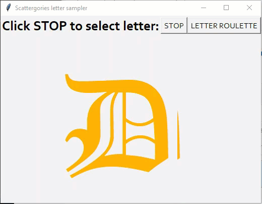

## Usage

For now it's just a script. 

Launch from shell with:

```shell
./scattergories_letter.py &
```

An environment is specified, but not required, as all of the libraries are standard (tkinter, random, time, string).

Now with SOUNDS
